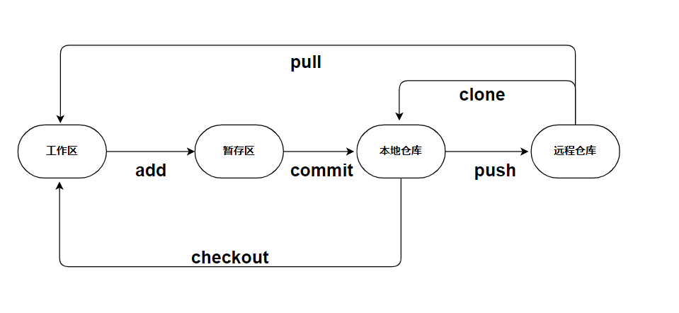

# git速成
## git是分布式版本控制系统
版本控制（Revision control）是一种在开发的过程中用于管理我们对文件、目录或工程等内容的修改历史，方便查看更改历史记录，备份以便恢复以前的版本的软件工程技术。

> + 实现跨区域多人协同开发

> + 追踪和记载一个或者多个文件的历史记录

> + 组织和保护你的源代码和文档

> + 统计工作量

> + 并行开发、提高开发效率

> + 跟踪记录整个软件的开发过程

> + 减轻开发人员的负担，节省时间，同时降低人为错误

简单说就是用于管理多人协同开发项目的技术。

没有进行版本控制或者版本控制本身缺乏正确的流程管理，在软件开发过程中将会引入很多问题，如软件代码的一致性、软件内容的冗余、软件过程的事物性、软件开发过程中的并发性、软件源代码的安全性，以及软件的整合等问题。
## git四区域
> + 工作区，就是平时存放项目代码的地方

> + 暂存区，用于临时存放改动，事实上它只是一个文件，保存即将提交到文件列表信息

> + 本地仓库，就是安全存放数据的位置，这里面有提交到所有版本的数据。其中HEAD指向最新放入仓库的版本

> + 远程仓库，托管代码的服务器，可以简单的认为是项目组中的一台电脑用于远程数据交换
git的工作流程一般是这样的：

１、在工作目录中添加、修改文件；

２、将需要进行版本管理的文件放入暂存区域；

３、将暂存区域的文件提交到git仓库。

因此，git管理的文件有三种状态：已修改（modified）,已暂存（staged）,已提交(committed)
## git简单指令

其中，文件有文件的四种状态，可以使用 `git status` 查看
> + Untracked: 未跟踪, 此文件在文件夹中, 但并没有加入到git库, 不参与版本控制. 通过git add 状态变为Staged.

> +  Unmodify: 文件已经入库, 未修改, 即版本库中的文件快照内容与文件夹中完全一致. 这种类型的文件有两种去处, 如果它被修改, 而变为Modified. 如果使用git rm移出版本库, 则成为Untracked文件

> + Modified: 文件已修改, 仅仅是修改, 并没有进行其他的操作. 这个文件也有两个去处, 通过git add可进入暂存staged状态, 使用git checkout 则丢弃修改过, 返回到unmodify状态, 这个git checkout即从库中取出文件, 覆盖当前修改 !

> +  Staged: 暂存状态. 执行git commit则将修改同步到库中, 这时库中的文件和本地文件又变为一致, 文件为Unmodify状态. 执行git reset HEAD filename取消暂存, 文件状态为Modified
## git分支
类似版本1、版本2的区别，互不影响，其中dev是开发版本  
主分支应该非常稳定，用来发布新版本，一般情况下不允许在上面工作，工作一般情况下在新建的dev分支上工作，工作完后，比如上要发布，或者说dev分支代码稳定后可以合并到主分支master上来。

>  列出所有本地分支  
 `git branch`

> 列出所有远程分支  
`git branch -r`

> 新建一个分支，但依然停留在当前分支  
`git branch [branch-name]`

> 新建一个分支，并切换到该分支  
`git checkout -b [branch]`

> 合并指定分支到当前分支  
`git merge [branch]`

> 删除分支  
`git branch -d [branch-name]`

> 删除远程分支  
`git push origin --delete [branch-name]`  
`git branch -dr [remote/branch]`
